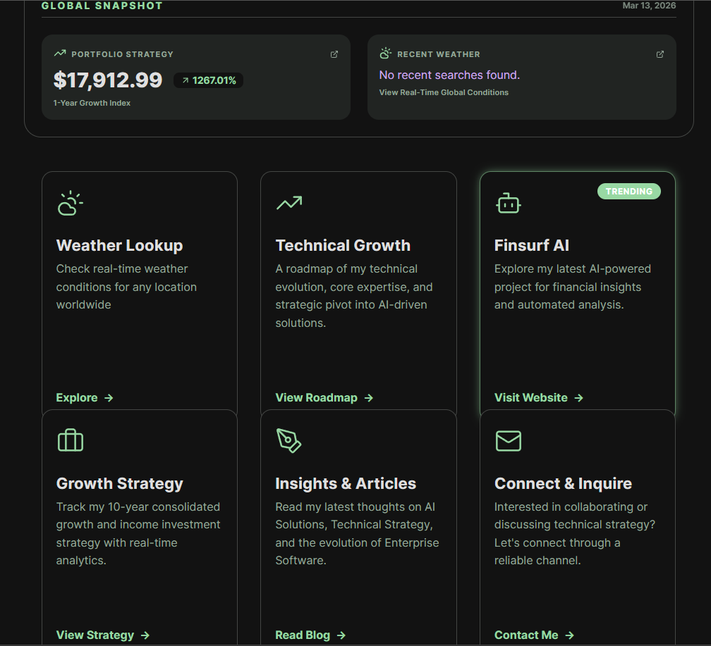

### The Humility of the "Build"

A few weeks ago, I found myself in a classic late-night tunnel. I was pushing code changes to a project, moving fast, skipping the dev server tests, and hitting "deploy" with a bit too much confidence.

The result? Vercel exploded.

A wall of TypeScript errors and build failures stared back at me because I’d managed to bury my `node_modules` in the wrong directory. It was a humbling reminder that in the world of AI and software, there is no "strategic vision" that can save you from a misplaced folder.

I’ve spent 3+ years managing high-stakes deployments for Fortune 500 clients like Worldpay and Fidelity Investments. But those late-night debugging sessions are where the real learning happens. They’ve taught me that to lead a strategy, you have to understand the friction of the execution.

### Solving the "Last Mile"

In my time as an Implementation Engineer and TAM, I managed five concurrent enterprise accounts with zero escalations. That record wasn't built on luck; it was built on bridging what I call the "Last Mile." The Last Mile is the gap between a brilliant technical concept and a corporate workflow where people actually get things done. I realized that to bridge that gap effectively, I needed to be more than a translator—I needed to be a builder.
Recent projects like **Finsurf.net** (market intelligence) and **weather-and-career** (career mapping) serve as live demonstrations of this integrated approach—combining real-time data processing with a user-centric design.

### My Current Workbench

Today, my "hands-on" focus is centered on making AI agentic and scalable:
*   **Agentic Intelligence:** I architect **LangGraph** state-machines using conditional routing. It’s about building agents that can actually reason—like my **FinSurf** project, which uses parallel fan-out to analyze market sentiment and dividends simultaneously.
*   **Production Rigor:** My stack is built on **TypeScript (React 19)** and **Python**. I’ve moved toward "zero SDK" integrations with Gemini and OpenAI to keep architectures lean and avoid the "bloat" that often kills enterprise performance.
*   **Operational Efficiency:** I don't just build for "coolness"; I build for ROI. At eGain, I used AI-generated scripts to cut reporting workflows from an hour down to 15 minutes—a 75% efficiency gain.

### The Builder's Philosophy

I write because I believe mastery is communal. Whether I'm documenting an LLM's token management or explaining why a multi-tenant cloud architecture needs a specific security handshake, I'm doing it to sharpen my own understanding.

Every post here is a reflection of a problem solved--often one that started with a "freaked out" Vercel build and ended with a more robust, production-ready solution. If you're a stakeholder looking for someone who can talk high-level strategy but isn't afraid to get their hands dirty in the `node_modules`, you're in the right place.

---
*Interested in seeing my work in action? Check out my latest technical deep-dives on [Finsurf.net](https://finsurf.net) or explore the [Technical Roadmap](/job-gap) here.*